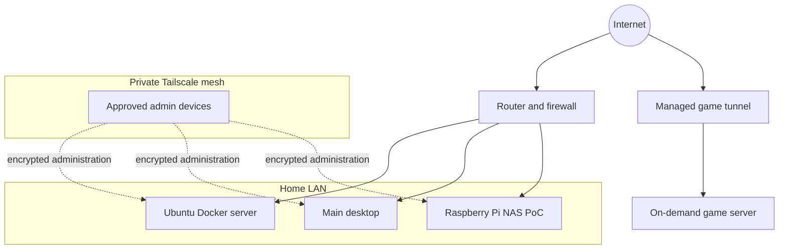

# Network topology

The homelab uses two distinct remote-access paths:

- **Tailscale mesh:** private administration and access between approved devices.
- **Game tunnel:** optional public access to a specific game-server port without exposing management services.

## Trust boundaries

- SSH and service administration are intended to remain reachable only from the LAN or Tailscale mesh.
- The public tunnel is limited to the game service it is configured to forward.
- Secrets, private addresses, device identifiers, and Tailscale configuration are intentionally omitted from this public documentation.

